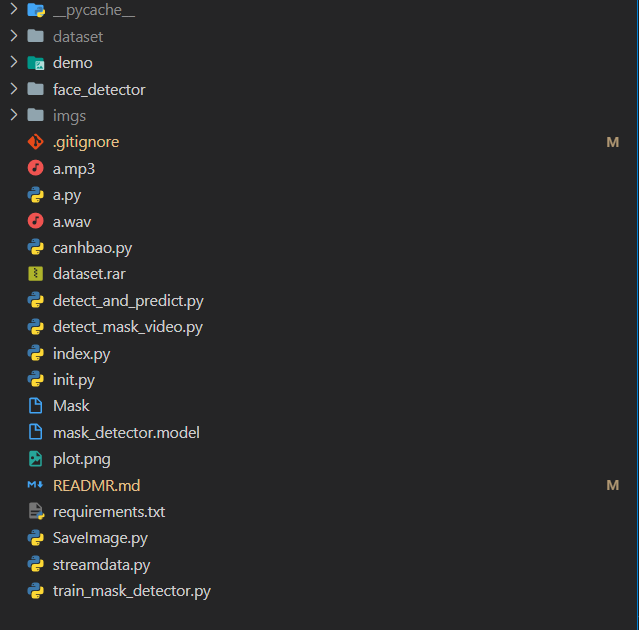
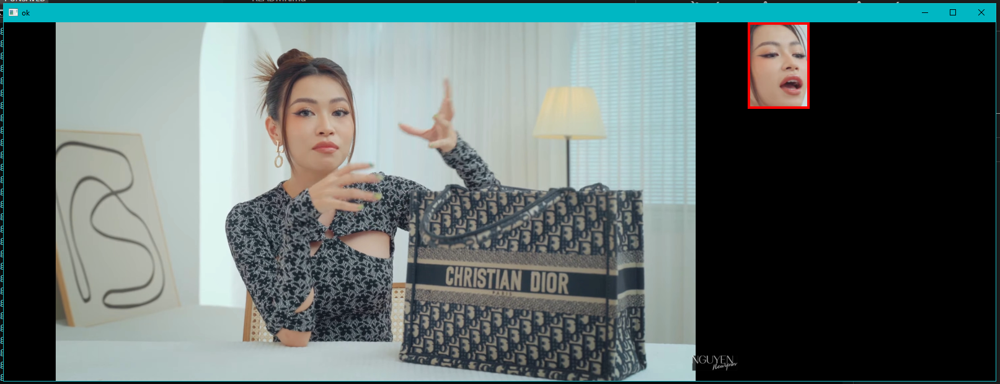
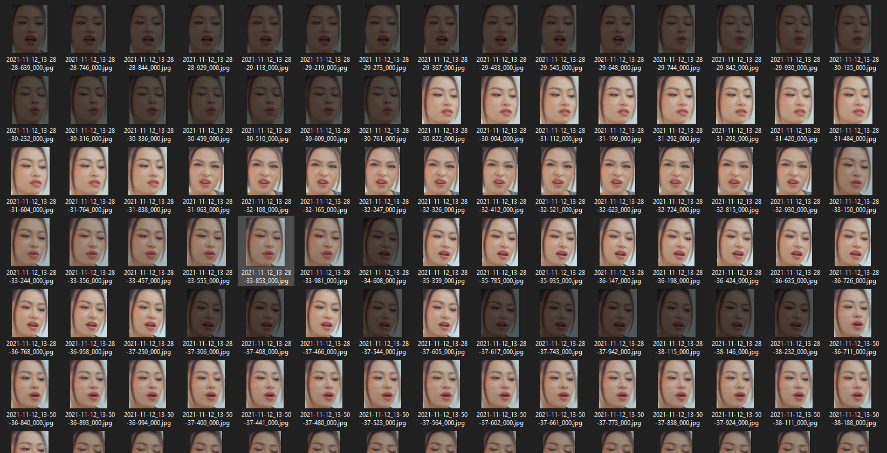

<h1 style="width: 100%; text-align: center; color: red; font-weight: bold;">ĐỒ ÁN CÔNG NGHỆ MỚI</h1>
 

 

    <h2>Thành viên thực hiện:</h2>
    <table>
        <tr>
            <th style="width: 200px">Họ và tên</th>
            <th style="width: 100px">Mã sinh viên</th>
            <th style="width: 100px">Ghi chú</th>
        </tr>
        <tr>
            <td>Nguyễn Quốc Tuấn</td>
            <td>18083891</td>
            <td>2</td>
        </tr>
        <tr>
            <td>Nguyễn Chí Khang</td>
            <td>17048731</td>
            <td></td>
        </tr>
        <tr>
            <td>Lê Đình Hiếu</td>
            <td>17030181</td>
            <td>1</td>
        </tr>
    </table>

 

    <a href="https://drive.google.com/file/d/18OSNzuYgDNS77L_loquzvbeBQDH4amBO/view?usp=sharing">
        Download file dataset.rar
    </a>

 

    

        <b style="color: red">Câu lệnh chạy: python3.9 index.py</b>
    

    

        <b style="color: red">Thư mục lưu ảnh: imgs</b>
    

    

        <b style="color: red">Kiểm tra sự thay đổi trên remote: git diff origin/main</b>
    

 

    
    <i>Cấu trúc thư mục lưu trữ</i>

 

    
    <i>Demo</i>

 

    
    <i>Thư mục lưu ảnh</i>

